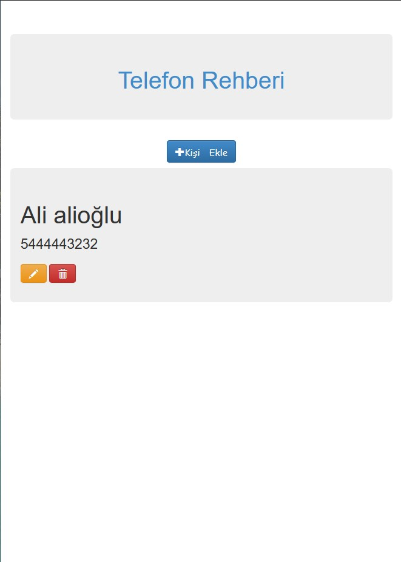

# BasicGuideDjango

Basic Guide with Python Django Framework

 

username: admin

password: boss1234

 

1) Create migrations for those changes

		python manage.py makemigrations
2) Apply those changes to the database

		python manage.py migrate

3) Start project
	
		python manage.py runserver

 
<table style="width:100%">
  <tr>
    <td></td>
    <td></td> 
  </tr>
  <tr>
    <td></td>
    <td></td> 
  </tr>
</table> 
 

 

<b>Created by <a href="https://www.linkedin.com/in/senerbatuhan/">Batuhan ŞENER</a></b>

 
